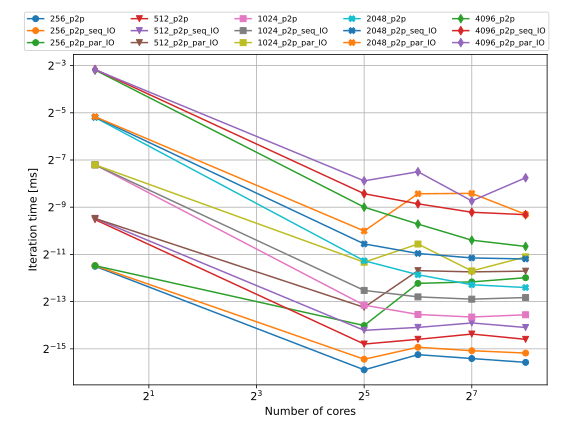

# PPP project course - MPI parallel heat solver
- Author: Ondřej Vlček

## File structure
    3rdparty           - Third party libraries
    doc                - Source files for student assignment docummentation
    eval_scripts       - Evaluation scripts 
    scripts            - Test scripts for students (*.sh, *.py, *.flt)
    sources            - Project source files

## Assignment package preparation
Following command will generate package that can be published as assignment for students. The `assignment.zip` file will
be placed in `build` directory.

    $ cd sources_solution
    $ mkdir build && cmake ..
    $ make assignment

## Results

### Measured scaling
| 1D | 2D |
| :-: | :-: |
|  |  |

### Measured efficiency
| 1D | 2D |
| :-: | :-: |
|  |  |

### Computational load

| 2D processes | 2D processes + threads |
| :-: | :-: |
|  |   |